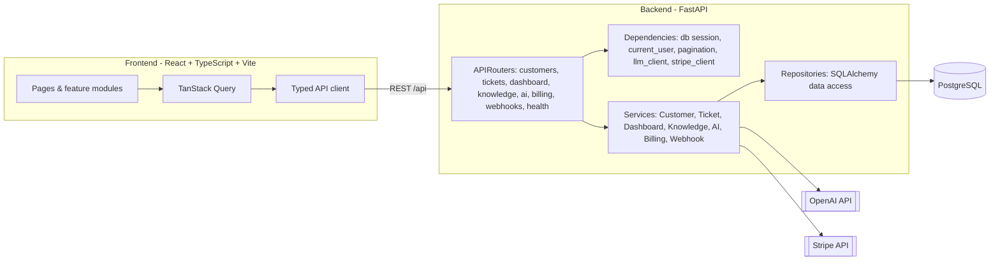

# SupportLedger AI - Support & Billing Operations Hub

A portfolio-grade SaaS operations platform that helps support teams resolve customer and billing issues faster. Built with **FastAPI + React/TypeScript + PostgreSQL**, following the project PRD.

> **Status:** Phases 0-4 are complete — Foundation, Core Support MVP, Knowledge Base, AI Assist v1, and Stripe Billing. Later phases (AI Billing Copilot, RAG + Guardrails, Production Polish) are scaffolded for but not yet implemented.

## What's implemented

- **Backend (FastAPI):** modular routers, dependency injection, services, repositories, SQLAlchemy 2.0 models, Alembic migrations, Pydantic v2 schemas, consistent error handling, and PyTest coverage.
- **Frontend (React + TypeScript, strict):** Vite, React Router, TanStack Query, a typed API client, and a clean Tailwind UI with loading / empty / error states throughout.
- **Domains:** Customers CRUD, Tickets CRUD with a status-transition state machine, ticket timeline (internal notes + customer replies), a dashboard summary, a Knowledge Base (articles + chunking + keyword search), AI Assist (classify / summarize / suggest-reply with an audit log), and Stripe Billing (invoices, payments, checkout sessions, idempotent webhooks).
- **UUID identifiers:** every entity uses UUID primary keys (cross-dialect `sa.Uuid()`), generated application-side.
- **Real integrations:** AI (OpenAI) and Billing (Stripe) are real-only — they require live API keys at runtime and return a clear error when keys are absent. All other features run without keys. Tests mock both providers so CI stays green.
- **DevOps:** Docker Compose (Postgres + backend + frontend), seed data, and GitHub Actions CI (backend lint + tests, frontend lint + typecheck + build).

## API surface

- **Customers:** `GET/POST /api/customers`, `GET/PATCH /api/customers/{id}`
- **Tickets:** `GET/POST /api/tickets`, `GET/PATCH /api/tickets/{id}`, `POST /api/tickets/{id}/messages`, `POST /api/tickets/{id}/resolve`
- **Dashboard:** `GET /api/dashboard/summary`
- **Knowledge base:** `GET/POST /api/knowledge/articles`, `GET/PATCH /api/knowledge/articles/{id}`, `POST /api/knowledge/articles/{id}/chunk`, `GET /api/knowledge/search?q=`
- **AI Assist:** `POST /api/ai/tickets/{id}/classify|summarize|suggest-reply`, `GET /api/ai/audit-logs`
- **Billing:** `GET /api/customers/{id}/billing`, `POST /api/customers/{id}/checkout-session`, `GET /api/invoices`, `GET /api/payments`
- **Webhooks:** `POST /api/webhooks/stripe`, `GET /api/webhooks/events`

## Architecture



### Repository layout

```
backend/          FastAPI app (app/), Alembic migrations, tests, Dockerfile
frontend/         React + TypeScript app (src/), Vite config, Dockerfile
docker-compose.yml
.github/workflows/ci.yml
.env.example
```

Backend internals follow the PRD structure: `app/api/v1/` (routers), `app/core/` (config, logging, errors), `app/db/` (session, base), `app/models/`, `app/schemas/`, `app/services/`, `app/repositories/`, `app/commands/seed.py`.

## Running with Docker (recommended)

```bash
docker compose up --build
```

- Frontend: http://localhost:5173
- API docs (Swagger): http://localhost:8000/docs
- Health: http://localhost:8000/api/health

The backend container automatically runs migrations, seeds demo data, and starts the API.

## Running locally (without Docker)

### Backend

```bash
cd backend
python -m venv .venv && source .venv/bin/activate
pip install -e ".[dev]"

# Point at a running Postgres, or use SQLite for a quick spin-up:
export DATABASE_URL="sqlite:///./dev.db"

python -m app.commands.seed          # create + seed tables
uvicorn app.main:app --reload --port 8000
```

### Frontend

```bash
cd frontend
npm install
VITE_API_BASE_URL="http://localhost:8000" npm run dev
```

## Commands

| Area     | Command                        | Purpose                          |
| -------- | ------------------------------ | -------------------------------- |
| Backend  | `uvicorn app.main:app --reload`| Run the API                      |
| Backend  | `pytest`                       | Run tests                        |
| Backend  | `ruff check .`                 | Lint                             |
| Backend  | `alembic upgrade head`         | Apply migrations                 |
| Backend  | `python -m app.commands.seed`  | Seed demo data                   |
| Frontend | `npm run dev`                  | Dev server                       |
| Frontend | `npm run typecheck`            | TypeScript check                 |
| Frontend | `npm run lint`                 | ESLint                           |
| Frontend | `npm run build`                | Production build                 |

## Environment variables

See [.env.example](.env.example). AI Assist requires `OPENAI_API_KEY` (and optionally `AI_MODEL`); Billing requires `STRIPE_SECRET_KEY`, `STRIPE_WEBHOOK_SECRET`, and `STRIPE_PRICE_ID_PRO`. These integrations are real-only: without the keys, the AI and billing endpoints return a clear `503` error while every other feature keeps working.

## Security notes (what's real vs mocked)

- **Auth is mocked**: a `get_current_user` dependency returns the seeded agent. This is the single seam to replace with real JWT/session auth later (PRD 6.1).
- **No card data is ever stored** - Stripe handles all payment details; the app only mirrors invoices/payments and verifies webhook signatures.
- **AI actions are audited**: every classify/summarize/suggest-reply writes an `ai_audit_logs` row, and suggested replies are labeled AI drafts requiring human review before sending.
- **Webhooks are idempotent**: events are deduped by `(provider, event_id)` so Stripe retries are safe.
- Secrets are read from environment variables and never committed.
- ORM parameterized queries guard against SQL injection.
- For a production deployment you would add real authentication, RBAC enforcement, rate limiting, and audit logging (planned in later phases).

## Testing

- Backend: `pytest` (31 tests) covers customer CRUD, ticket workflows (status transitions, resolve, message timeline), dashboard counts, knowledge base (CRUD, chunking, search), AI Assist (structured classification, invalid-JSON safe failure, audit logging) with a fake LLM, and Stripe billing (checkout session, idempotent webhooks, billing summary) with a fake Stripe client. Everything runs against in-memory SQLite with dependency overrides - no external services required.
- Frontend: type safety is enforced via `npm run typecheck`, `npm run lint`, and `npm run build`; component/e2e tests are planned for later phases per the PRD.

## Roadmap

| Phase | Name               | Status        |
| ----- | ------------------ | ------------- |
| 0     | Foundation         | Done          |
| 1     | Core Support MVP   | Done          |
| 2     | Knowledge Base     | Done          |
| 3     | AI Assist v1       | Done          |
| 4     | Stripe Billing     | Done          |
| 5     | AI Billing Copilot | Planned       |
| 6     | RAG + Guardrails   | Planned       |
| 7     | Production Polish  | Planned       |
```
